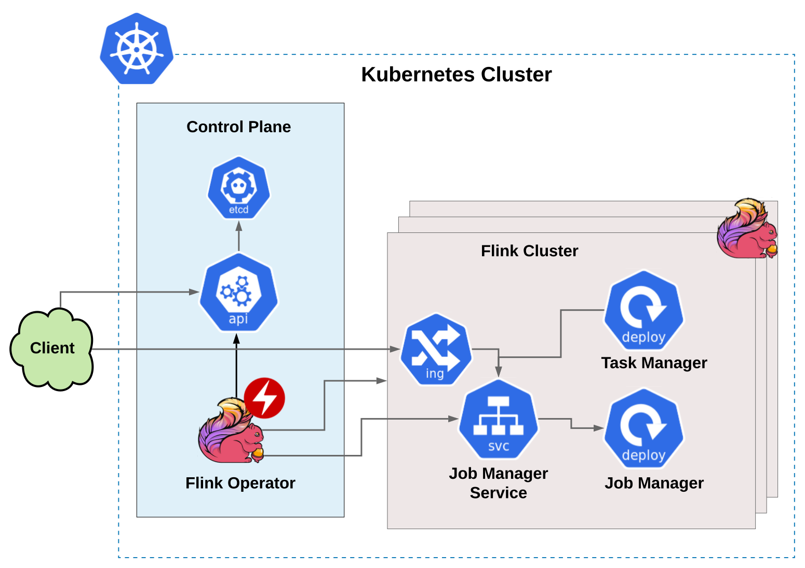

# Flinkk8soperator
FlinkK8sOperator is a [Kubernetes operator](https://coreos.com/operators/) that manages [Flink](https://flink.apache.org/) applications on Kubernetes. The operator acts as control plane to manage the complete deployment lifecycle of the application.

## Project Status

*Beta*

The operator is in use for some less-critical jobs at Lyft. At this point the focus is on testing and stability. While in 
Beta, we will attempt to limit the number of backwards-incompatible changes, but they may still occur as necessary. 

## Prerequisites
* Version >= 1.10 of Kubernetes (versions < 1.13 require `--feature-gates=CustomResourceSubresources=true`)
* Version >= 1.7 of Apache Flink.

## Overview

The goal of running Flink on Kubernetes is to enable more flexible, lighter-weight deployment of streaming applications, without needing to manage infrastructure. The Flink operator aims to abstract out the complexity of hosting, configuring, managing and operating Flink clusters from application developers. It achieves this by extending any kubernetes cluster using a [custom resources](https://kubernetes.io/docs/concepts/extend-kubernetes/api-extension/custom-resources).

The Operator creates flink clusters dynamically using the specified custom resource. Flink clusters in kubernetes consist of the following:
* JobManager [Deployment](https://kubernetes.io/docs/concepts/workloads/controllers/deployment/)
* TaskManager [Deployment](https://kubernetes.io/docs/concepts/workloads/controllers/deployment/)
* JobManager [Service](https://kubernetes.io/docs/concepts/services-networking/service/)
* JobManager [Ingress](https://kubernetes.io/docs/concepts/services-networking/ingress/) for the UI (optional)

Deploying and managing Flink applications in Kubernetes involves two steps:

* **Building Flink application packaged as a docker image:** A docker image is built containing the application source code with the necessary dependencies built in. This is required to bootstrap the Jobmanager and Taskmanager pods. At Lyft we use Source-To-Image [S2I](https://docs.openshift.com/container-platform/3.11/architecture/core_concepts/builds_and_image_streams.html#source-build) as the image build tool that provides a common builder image with Apache Flink pre-installed. The docker image could be built using any pre-existing workflows at an organization.

* **Creating the Flink application custom resource:** The custom resource for Flink application provides the spec for configuring and managing flink clusters in Kubernetes. The FlinkK8sOperator, deployed on Kubernetes, continuously monitors the resource and the corresponding flink cluster, and performs action based on the diff.

## Documentation

* [Quick start guide](/docs/quick-start-guide.md)
* [User guide](/docs/user_guide.md)
* [Flink application custom resource](/docs/crd.md)
* [Operator state machine](/docs/state_machine.md)

## Community

* Join our [Slack](http://go.lyft.com/flinkoperator_slack) channel.
* Check out [who is using FlinkK8sOperator](docs/who-is-using.md).

We welcome you to contribute and make the operator better! For questions, and changes please create an [issue](https://github.com/lyft/flinkk8soperator/issues/new) or submit a [pull request](https://github.com/lyft/flinkk8soperator/compare).
