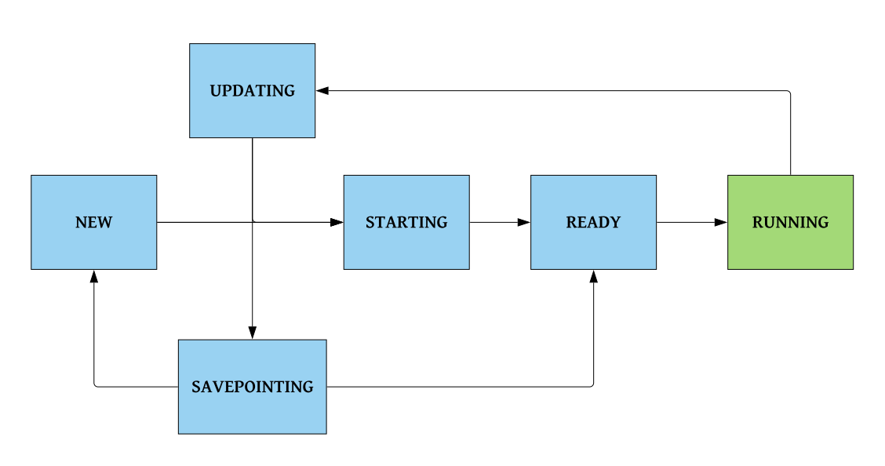

# Flink operator state machine

The core logic of the operator resides in the state machine. Various stages of the deployment lifecycle are mapped to discrete states. The operator continuously monitoring the flink application custom resource and tries to move the resource to the intended desired state. It does this by observing the current state, takes a set of corresponding actions and pushes the resource to the desired state.  The final desired state is **RUNNING** and this indicates that a healthy Flink Cluster has been started with a flink job running in it.

## State **NEW**
* The **NEW** state indicates that the Flink custom resource has been newly created. In this state, the operator creates a new Flink Cluster for the application. The deployment objects created by the operator are labelled and annotated as indicated in the custom resource. The operator also sets the corresponding Environment variables and arguments for the containers to start up the Flink application from the image.

## State **STARTING**
* The **STARTING** state indicates that the Flink Application Cluster is starting, and the Kubernetes POD states created in the previous states are transitioning to Running. The custom resource state can reach Starting from following states *NEW*, *UPDATING*. In this state, the operator waits for the pods to reach Running state before taking desired action.

## State **READY**
* The **READY** state indicates that all the Kubernetes pods corresponding to the Flink application cluster states are Running. If the Flink cluster is ready, the operator uses the Job Manager Service to make Http Request to the Jobmanager, to check if it is ready to accept requests through REST API.
* Once the Job Manager is ready to take traffic, the operator check if there is a job running on the Flink cluster. If there is no job running, the operator starts the job from the savepoint (if available) using the [SubmitJob API](https://ci.apache.org/projects/flink/flink-docs-stable/monitoring/rest_api.html#jars-jarid-run), and transitions the state to *RUNNING*.

## State **RUNNING**
* The **RUNNING** state indicates that the flink application custom resource has reached a desired state and job is running in the flink cluster. In this state, the operator continuously checks that if the resource has been modified. The operator also monitors the cluster status and updates the status field in the custom resource if there is a diff.

## State **SAVEPOINTING**
* The **SAVEPOINTING** state indicates that the operator triggered savepoint request is in progress. The savepoint request is asynchronous. The operator polls for the savepoint status, and if the savepoint succeeds, the operator proceeds to delete the deployments corresponding to old flink application. If the savepointing fails, then the operator tries to fetch the *Externalized checkpoint*, and uses it to submit the job in the new cluster.

## State **UPDATING**
The **UPDATING** state indicates that the flink custom resource values do not match with the current running flink application cluster. This state handles all the cases of updating the underlying Flink cluster. The operator tries to bring up a new cluster taking into account the deployment mode - Single/Dual.

## State **DELETING**
The **DELETING** state indicates that the application custom resource has been deleted. In this state, the operator before propagating the deletion to other owner references, cancels the job running in the cluster with a savepoint.
