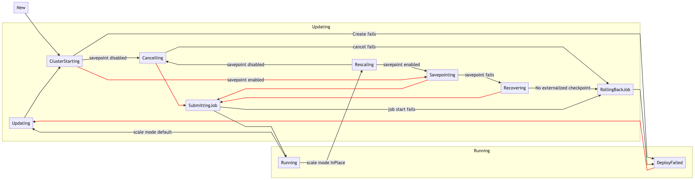

# Flink operator state machine

The core logic of the operator resides in the state machine. Various stages of the deployment lifecycle are mapped to
discrete states. The operator continuously monitors the FlinkApplication custom resource. When it becomes out of sync 
with the underlying Kubernetes resources, it takes the necessary actions to update those resources to the desired state. 
Typically this will involve traversing the state machine. The final desired state is `Running`, which indicates that a 
healthy Flink cluster has been started and the Flink job has been successfully submitted.

The state machine for a `Dual` deployment mode  (default) looks like this:

The state machine for a `BlueGreen` deployment mode looks like this: 

# States

### New / Updating
`New` (indicated in the resource by the empty string) is the initial state that all FlinkApplication resources start in. 
`Updating` is transitioned to when a change is made to an existing FlinkApplication. In both cases, a new cluster is
created, and we transition to the ClusterStarting phase to monitor. The deployment objects created by the operator are 
labelled and annotated as indicated in the custom resource. The operator also sets the corresponding environment 
variables and arguments for the containers to start up the Flink application from the image. 
#### BlueGreen deployment mode
Along with the annotations and labels in the custom resources, the deployment objects are suffixed with the application
version name, that is either `blue` or `green`. The version name is also injected into the container environment.
Additionally, the external URLs for each of the versions is also suffixed with the color.
### Rescaling
If `scaleMode` is set to `InPlace`, an increase in parallelism will trigger a progression to `Rescaling` rather than
`Updating`. In this mode, we increase the size the existing TaskManager deployment instead of creating a new one, after
which we proceed with Cancelling or Savepointing depending on the `savepointDisabled` setting.
#### BlueGreen deployment mode
InPlace rescaling is not compatible with BlueGreen, so this state will not be reached in BlueGreen mode.
### ClusterStarting
In this state, the operator monitors the Flink cluster created in the New state. Once it successfully starts, we check
if the spec has `savepointDisabled` field set to true. If yes, we transition to `Cancelling` state else to `Savepointing`. 
If we are unable to start the cluster for some reason (an invalid 
image, bad configuration, not enough Kubernetes resources, etc.), we transition to the `DeployFailed` state.
#### BlueGreen deployment mode
In this mode, once the new cluster is started, we transition into the `Savepointing`/`SubmittingJob` mode based on the `savepointDisabled`
flag. There is no job cancellation involved in the update process during a BlueGreen deployment.
### Cancelling
In this state, the operator attempts to cancel the running job (if exists) and transition to `SubmittingJob` state. 
If it fails, we transition to `RollingBack`.
#### BlueGreen deployment mode
This state is not reached during a BlueGreen deployment.
### Savepointing
In the `Savepointing` state, the operator attempts to cancel the existing job with a 
[savepoint](https://ci.apache.org/projects/flink/flink-docs-release-1.8/ops/state/savepoints.html) (if this is the first
deploy for the FlinkApplication and there is no existing job, we transition straight to `SubmittingJob`). The operator
monitors the savepoint process until it succeeds or fails. If savepointing succeeds, we move to the `SubmittingJob` 
phase. If it fails, we move to the `Recovering` phase to attempt recovering from an externalized checkpoint.
#### BlueGreen deployment mode
In this state, during a BlueGreen deployment, the currently running Flink job is savepointed (without cancellation).
### Recovering
If savepointing fails, the operator will look for an
[externalized checkpoint](https://ci.apache.org/projects/flink/flink-docs-release-1.8/ops/state/checkpoints.html#resuming-from-a-retained-checkpoint)
and attempt to use that for recovery.  If one is not availble, the application transitions to the `DeployFailed` state. 
Otherwise, it transitions to the `SubmittingJob` state.
#### BlueGreen deployment mode
There is no change in behavior for this state during a BlueGreen deployment.
### SubmittingJob
In this state, the operator waits until the JobManager is ready, then attempts to submit the Flink job to the cluster. 
If we are updating an existing job or the user has specified a savepoint to restore from, that will be used. Once the 
job is successfully running the application transitions to the `Running` state. If the job submission fails we 
transition to the `RollingBack` state.
#### BlueGreen deployment mode
During a BlueGreen deployment, the operator submits a job to the newly created cluster (with a version that's different from the
originally running Flink application version).
### RollingBack
This state is reached when, in the middle of a deploy, the old job has been canceled but the new job did not come up
successfully. In that case we will attempt to roll back by resubmitting the old job on the old cluster, after which
we transition to the `DeployFailed` state.
#### BlueGreen deployment mode
In the BlueGreen deployment mode, the operator does not attempt to resubmit the old job (as we never cancel it in the first place).
We transition directly to the `DeployFailed` state.
### Running
The `Running` state indicates that the FlinkApplication custom resource has reached the desired state, and the job is 
running in the Flink cluster. In this state the operator continuously checks if the resource has been modified and
monitors the health of the Flink cluster and job. 
#### BlueGreen deployment mode
There is no change in behavior for this state during a BlueGreen deployment.
### DeployFailed
The `DeployFailed` state operates exactly like the `Running` state. It exists to inform the user that an attempted
update has failed, i.e., that the FlinkApplication status does not currently match the desired spec. In this state,
the user should look at the Flink logs and Kubernetes events to determine what went wrong. The user can then perform
a new deploy by updating the FlinkApplication.
#### BlueGreen deployment mode
There is no change in behavior for this state during a BlueGreen deployment.
### Deleting
This state indicates that the FlinkApplication resource has been deleted. The operator will clean up the job according
to the DeleteMode configured. Once all clean up steps have been performed the FlinkApplication will be deleted.
#### BlueGreen deployment mode
In this mode, if there are two application versions running, both versions are deleted (as per the `DeleteMode` configuration).
### DualRunning
This state is only ever reached when the FlinkApplication is deployed with the BlueGreen deployment mode. In this state,
there are two application versions running — `blue` and  `green`. Once a user is ready to tear down one of the versions, they
set a `tearDownVersionHash`. If this is set, the operator then tears down the application version corresponding to
the `tearDownVersionHash`. Once the teardown is complete, we transition back to the `Running` state.
